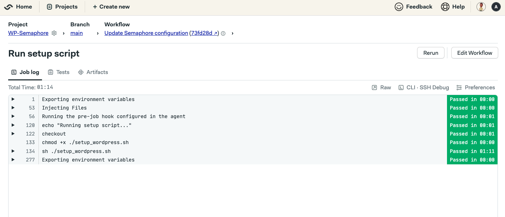

# WP-Semaphore

This project contains a SemaphoreCI workflow to set up WordPress and MySQL using Docker Secrets. It is designed to be run on SemaphoreCI.

## How to use

To use this project, make sure you have a SemaphoreCI account. If you don't have one, sign up [here](https://semaphoreci.com/signup).

After that, clone the repository using the following command:

```
git clone https://github.com/Aahil13/WP-Semaphore.git
```

Now, select your cloned copy of this project on your Semaphore UI. Once you do, run the workflow, and you should see the output of the setup script:



## What's in this project

This project contains a `setup_wordpress.sh` script, which includes the steps to set up WordPress and MySQL. This script follows the steps described in this [article](https://article-link).

The `.semaphore` folder contains the `semaphore.yml`, which includes the steps to run this script.

The steps of this build include:

- Checking out the repository
- Making the `setup_wordpress.sh` script executable
- Executing the script.